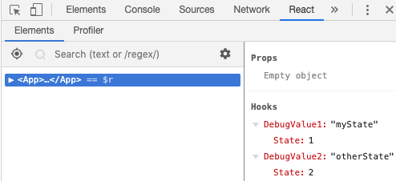
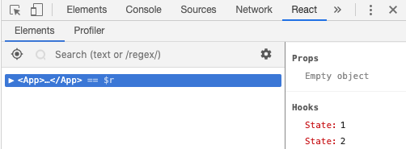

# babel-plugin-react-hooks-debug-value
Babel plugin to give React Hooks a label via `useDebugValue`.

With this plugin, it's clear in React DevTools which hook values correspond to which variables.

This is intended for development only.

Suppose you have this code:

```js
const MyComp = () => {
  const [myState, setMyState] = useState(1);
  const [otherState, setOtherState] = React.useState(2);

  return <Ok />
}
```

You'll now see this:



Instead of this:


`

since the code is transformed into this:

```js
const useDebugValue2 = (...args) => {
  useDebugValue("otherState");
  return React.useState(...args);
};

const useDebugValue1 = (...args) => {
  useDebugValue("myState");
  return useState(...args);
};

const MyComp = () => {
  const [myState, setMyState] = useDebugValue1(1);
  const [otherState, setOtherState] = useDebugValue2(2);

  return React.createElement(Ok, null);
};
```

## Install

```console
npm add -D babel-plugin-react-hooks-debug-value
```

In your Babel config (scoping to your dev build somehow):

```js
module.exports = {
  plugins: ['babel-plugin-react-hooks-debug-value']
}
```
